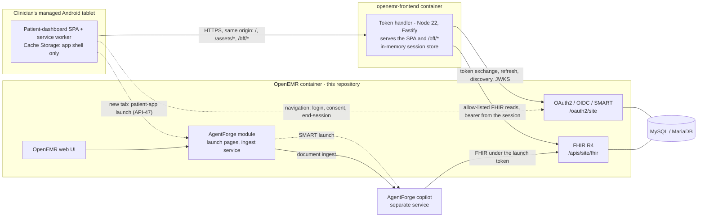

# Architecture

How the parts of this repository fit together, and why they are built the way they are. Requirement and
behaviour IDs (`FR-`, `NFR-`, `Q-`, `BUG-`) are in [REQUIREMENTS.md](REQUIREMENTS.md); server calls (`API-`) in
[INTERFACES.md](INTERFACES.md); configuration and deployment in [DEPLOYMENT.md](DEPLOYMENT.md).

## 1. Components

Solid lines are requests made by code; dotted lines are browser navigations.

| Component | Where | Runs as | Holds |
|---|---|---|---|
| **OpenEMR** | the repository root | One container built from `docker/railway/Dockerfile` (Apache + PHP 8.5 on Alpine), with a MySQL / MariaDB database and a `sites` volume | All clinical data, users, ACLs, OAuth clients, the audit log |
| **AgentForge module** | `interface/modules/custom_modules/oe-module-agentforge/` | Inside OpenEMR (PHP), registered and enabled on first boot | Its settings, in OpenEMR's `globals` table |
| **Patient-dashboard SPA** | `openemr-frontend/src/` | In the tablet's browser, as an installed PWA | The theme choice and card collapse state in `localStorage`; nothing clinical |
| **Token handler** | `openemr-frontend/bff/` | One container built from `openemr-frontend/Dockerfile`, which also carries the built SPA | Server-side sessions (OAuth tokens) in process memory |
| **AgentForge copilot** | not in this repository | Its own service | Its own data; it reads OpenEMR's FHIR API under a SMART launch |

## 2. How the frontend works

### 2.1 One origin, a token handler, no tokens in the browser
OpenEMR refuses `user/` scopes to public OAuth clients ([BUG-1](REQUIREMENTS.md#bug-1)), so a browser-only app
cannot open an arbitrary patient's chart for a clinician. The decision ([Q-7](REQUIREMENTS.md#q-7)) is a small
**token handler** (a "backend for frontend") on the SPA's own origin. It:

- serves the built SPA and its own `/bff/*` routes from **one HTTPS origin**, so the browser never makes a
  cross-origin call and OpenEMR's CORS behaviour ([BUG-2](REQUIREMENTS.md#bug-2)) does not matter;
- is a **confidential** OAuth client: it runs authorization code + PKCE, holds the client secret, and keeps the
  access, refresh and id tokens in server memory keyed by an opaque session id;
- gives the browser only an `HttpOnly; Secure; SameSite=Strict` `__Host-` session cookie (and, during sign-in, a
  short-lived `SameSite=Lax` handshake cookie);
- proxies an **allow-list** of FHIR reads (API-10…24), attaching the bearer token server-side, caching nothing and
  logging no bodies, paths or tokens ([FR-BFF-3](REQUIREMENTS.md#fr-bff-3), [FR-BFF-5](REQUIREMENTS.md#fr-bff-5));
- refreshes the access token itself, one refresh per session at a time, and ends a session after 15 minutes
  without an authenticated request or 10 hours after sign-in ([FR-BFF-4](REQUIREMENTS.md#fr-bff-4)).

Cross-site request forgery is handled by POST-only state changes checked on `Sec-Fetch-Site` (or `Origin`) plus the
`SameSite=Strict` cookie ([FR-BFF-6](REQUIREMENTS.md#fr-bff-6)). Every response carries a strict CSP, HSTS,
`Referrer-Policy: same-origin` and `nosniff` ([NFR-SEC-2](REQUIREMENTS.md#nfr-sec-2)). The routes and the flows in
detail are in the [token handler README](openemr-frontend/bff/README.md).

### 2.2 The main flows
- **Sign-in** (API-40, API-41): the SPA posts `/bff/login`; the token handler stores a PKCE handshake and redirects
  the browser to OpenEMR's login and consent; OpenEMR redirects back to `/bff/callback`; the token handler
  exchanges the code, verifies the `id_token`, sets the session cookie and returns to the SPA.
- **Reading a chart** (API-44): each card's query calls `/bff/fhir/...`; the token handler checks the allow-list,
  the origin and the session, waits for an upstream slot (4 at once, 3 per session — FHIR is slow,
  [BUG-28](REQUIREMENTS.md#bug-28)), and forwards with the session's bearer. A read counts as activity.
- **Staying signed in** (API-42, API-46): `/bff/session` gives the deadline but is not activity; touch, key or
  scroll in the app sends the keep-alive. The app warns a minute before the deadline.
- **Sign-out** (API-43): the session is destroyed, then the browser goes to OpenEMR's end-session endpoint with
  `id_token_hint` — the one bounded case where a token passes through the browser ([BUG-5](REQUIREMENTS.md#bug-5)) —
  and back to `/signed-out`.
- **Patient-app launch** (API-47): a new-tab link straight to the AgentForge module's launch page on OpenEMR's
  origin; nothing passes through the token handler.
- **Offline**: the service worker serves the precached app shell; no clinical data is available offline.

### 2.3 Inside the SPA
- **Cards are independent.** Each card is its own TanStack Query read inside an error boundary keyed by the
  patient, with its own loading, empty, error and not-authorised states; one failing card never blanks the
  dashboard ([FR-CARD-1](REQUIREMENTS.md#fr-card-1)).
- **Parse at the boundary.** Every response is parsed by Zod in `src/api/`; a Bundle is parsed per entry, so a bad
  entry becomes a "Could not display this item" row and never a crash ([FR-CARD-3](REQUIREMENTS.md#fr-card-3)).
  Only `src/api/` may touch the network (enforced by lint).
- **OpenEMR's quirks are explicit.** Each workaround for an OpenEMR behaviour is a typed case citing its `BUG-` id:
  date windows instead of paging ([BUG-7](REQUIREMENTS.md#bug-7)), wall-clock dates
  ([BUG-51](REQUIREMENTS.md#bug-51)), every MedicationRequest intent ([BUG-13](REQUIREMENTS.md#bug-13)), and so on.
- **No PHI at rest.** The service worker precaches only `index.html` and the fingerprinted `assets/`, with no
  runtime caching; sign-out and the automatic logoff clear every query cache; a privacy cover hides the screen
  when the app is backgrounded ([NFR-SEC-1](REQUIREMENTS.md#nfr-sec-1), [FR-UI-4](REQUIREMENTS.md#fr-ui-4)).
- **Theme.** MUI v9 themed from one token file (`src/theme/tokens.ts`) whose light and dark values come from
  OpenEMR's own `style_light` and `style_dark` SCSS, adjusted only where needed for WCAG AA contrast.

## 3. Why React and TypeScript

Two questions are kept apart: **leaving PHP for an API-fed single-page app**, which is where nearly every real cost
comes from (any framework pays them), and **which framework**, a narrower choice.

**What the choice had to satisfy:** the existing APIs only, with no backend change
([NFR-CON-1](REQUIREMENTS.md#nfr-con-1)); reimplement rather than redesign, looking like OpenEMR in light and dark;
installable on an Android tablet with no PHI at rest; strictly typed, with payloads validated at the boundary;
WCAG 2.2 AA and 48 dp touch targets; test-first; and a short port.

**What each piece buys.** *React 19* function components map one-to-one onto the legacy dashboard's card framework
(one template per card, its own collapse control and empty state), and React has the deepest bench for the other
pieces — MUI, TanStack Query, React Testing Library, MSW. *TypeScript, strict* (plus `noUncheckedIndexedAccess` and
`exactOptionalPropertyTypes`, Google style via `gts`), and the token handler is written in the same language, so the
two share Zod schemas. *MUI v9 (Material 3)* gives accessible, touch-sized components whose theme engine takes
OpenEMR's palette. *Vite* drives the dev server, the Vitest runner and Playwright's web server from one config, and
emits a static build the token handler serves.

| Option | Verdict |
|---|---|
| Keep server-rendered PHP/Twig and restyle | Rejected — the iframe shell, hover menus and CSRF-posted fragments *are* the tablet problem, every change is a backend change, and there is no install story |
| AngularJS 1.8 (already in OpenEMR) | Rejected — end of life, and the dashboard does not use it |
| Angular (current) | Viable; rejected on weight — dependency injection, RxJS and forms machinery a read-only dashboard does not use |
| Vue 3 | The honest runner-up; it would have met every constraint. Its template type-checking sits outside the TypeScript compiler and the strict lint rules, and its Material 3 bench is smaller |
| Svelte 5 | Rejected — no Material library of MUI's maturity, so theming and accessibility would be hand-built |
| Native Android (Kotlin) | Rejected — a second codebase; the request was a modern *web* presentation layer |
| Capacitor around the same SPA | Kept as the escalation path for app-level screenshot blocking ([REQUIREMENTS.md](REQUIREMENTS.md) §8.5) |

React over Vue is a preference with reasons — MUI's Material 3 theming, `.tsx` type-checking end to end under the
strict lint, and the test conventions — not a proof.

**What leaving PHP gained:** a typed, parsed API boundary where every server call is inventoried and every OpenEMR
quirk is an explicit case; behaviour tested through the DOM with no backend (Vitest, React Testing Library,
Playwright at both tablet orientations, an axe scan in both themes); an installable PWA with a shell-only cache; no
token in the browser; light, dark and match-device themes from OpenEMR's own palette; and a presentation layer that
ships without an OpenEMR release.

**What it cost:**
- **A new service to own.** The token handler is a second runtime to build, deploy, patch and watch; it proxies
  clinical reads, so it is in HIPAA scope and must stream, never cache, never log bodies; it needs its own CSRF design
  and session plumbing (refresh serialised per session, a maximum session length, an exact logout).
- **An extra hop on a slow API.** FHIR searches already take seconds under fan-out
  ([BUG-28](REQUIREMENTS.md#bug-28)); the 2-second target is an open risk ([Q-8](REQUIREMENTS.md#q-8)).
- **Scope fragility.** One uncatalogued scope fails the whole sign-in ([BUG-11](REQUIREMENTS.md#bug-11)); unregistered
  ones are dropped silently ([BUG-20](REQUIREMENTS.md#bug-20)); `aud` must match a global exactly
  ([BUG-17](REQUIREMENTS.md#bug-17)).
- **What FHIR does not say.** The PHP page read the database, so severity, end dates and "list reviewed" came free;
  over FHIR they are missing or lossy, which is the parity gap list ([REQUIREMENTS.md](REQUIREMENTS.md) §6.3).
- **No PHP events.** Module buttons injected through PHP events do not appear; per-patient launches became
  configuration ([FR-APP-1](REQUIREMENTS.md#fr-app-1)).

## 4. Changes to upstream OpenEMR

The frontend changes nothing in OpenEMR ([NFR-CON-1](REQUIREMENTS.md#nfr-con-1)). The AgentForge integration and
the deployment do change a few upstream files; each change is small and self-contained:

| File | Change | Why |
|---|---|---|
| `src/Common/Session/SessionUtil.php`, `src/RestControllers/AuthorizationController.php`, `library/auth.inc.php` | A short-lived, single-use `SameSite=Lax` **EHR-launch bridge cookie**, read by the authorization controller when the `SameSite=Strict` core session cookie is withheld on a cross-site redirect, and cleared at logout | Lets an EHR launch (the AgentForge copilot) complete its OAuth exchange without OpenEMR showing a second login |
| `src/Common/Command/Register.php`, `src/Core/OEGlobalsBag.php` | `openemr:register` can register, install and enable a custom module in one idempotent step | The container registers and enables the AgentForge module on boot |
| `src/Services/Background/SymfonyBackgroundServiceSpawner.php`, `docker/release/openemr.conf` | Forward `AGENTFORGE_INGEST_URI` and `AGENTFORGE_INGEST_CATEGORY_MAP` into background-service child processes (`PassEnv`) | Under mod_php, container variables otherwise never reach the document-ingest job |
| `src/RestControllers/TokenIntrospectionRestController.php` | Correct an operator-precedence bug in the `is_enabled` check | Token introspection treated disabled clients wrongly |
| `src/Services/FHIR/FhirPatientService.php` | `Patient.active` mirrors `deceased[x]` | Was always `true` ([BUG-6](REQUIREMENTS.md#bug-6)) |
| `templates/oauth2/oauth2-login.html.twig`, `oauth2-base.html.twig` | Allow pinch-zoom; label the login fields | Accessibility of the OAuth login the frontend's users see ([BUG-39](REQUIREMENTS.md#bug-39), [BUG-40](REQUIREMENTS.md#bug-40)) |
| `docker/railway/Dockerfile`, `railway.json` | An image built from **this** repository's source (derived from upstream's `docker/release/Dockerfile`, which clones upstream instead) | The deployable OpenEMR image ([DEPLOYMENT.md](DEPLOYMENT.md) §3) |
| `docker/release/openemr.sh` | Fixes to first-time setup on a fresh volume; one-time setup scripts removed unless `RUN_DB_UPGRADE=yes`; bundled custom modules registered and enabled on boot; the AgentForge synthetic seed on every boot where declared, refused in production | Reliable container boots and reproducible demo environments |
| `phpstan.neon.dist`, `rector.php`, `.phpstan/` baselines | Static-analysis configuration for the new code | — |

The upstream copyright and licence headers in these files are unchanged.

## 5. The AgentForge module

The module (`OpenEMR\Modules\AgentForge`) hooks OpenEMR's event dispatcher; it does not patch core pages.

- **Launch button** — a `PageHeadingRenderEvent` listener adds **Launch AgentForge** to the patient demographics
  page only. `AgentForgeLaunchService` builds a SMART EHR launch to the copilot's launch URI for the current
  patient; it opens in a modal frame or a new tab (`agentforge_launch_mode`). A launch whose `/launch` and OAuth
  callback land on different hosts loses its session, so every address must be the same front door
  ([DEPLOYMENT.md](DEPLOYMENT.md) §5).
- **Day's Agenda** — a `MenuEvent` listener adds a menu item that opens the copilot's roster launch
  (`agentforge_agenda_launch_uri`, falling back to the launch URI) in its own tab.
- **Drill-down launch** — `public/agenda-drilldown-launch.php?patient={uuid}` resolves a patient by FHIR id,
  re-checks the `patients/demo` ACL, sets the bridge cookie (§4) and redirects to the patient-scoped launch in one
  top-level navigation. The frontend's Patient apps slot links here.
- **Document ingest** — a registered OpenEMR background service (`agentforge_ingest_new_documents`) scans documents
  newer than a watermark whose category is mapped to a document type, forwards each to the copilot's ingest
  address, and advances the watermark. With no ingest address or no category map it does nothing (fail closed).
- **Settings** — `AgentForgeGlobalConfig` reads each setting from OpenEMR's `globals` table (the module's settings
  form) and falls back to an environment variable.
- **Seeders** — idempotent CLI scripts (`scripts/`) and their rules (`src/Seed/`) create the synthetic AF-DEMO
  cardiology cohort, rolling appointments, care teams, and an integration-test `client_credentials` client. The
  container runs them on every boot only where declared, never in production.

## 6. Data, state and scaling

| Store | Holds | Sensitive | Retention |
|---|---|---|---|
| OpenEMR database and `sites` volume | All PHI, users, ACLs, OAuth clients, the audit log, uploaded documents | Yes | The deployment's backups |
| Token-handler session store (`MemoryStore`, `bff/src/session_store.ts`) | Sessions and in-flight sign-in handshakes, at most 10 000 each | Yes — OAuth tokens | Process memory only: a restart signs everyone out |
| Proxied FHIR bodies | One answer, up to 16 MiB, for one request | Yes | Never cached or written to disk |
| Token-handler logs (stdout, JSON lines) | Method, route shape, `API-` id, status, latency | No PHI by rule | The platform's log retention |
| Browser `localStorage` / service-worker cache | Theme, card collapse state / the app shell | No | Until cleared / replaced each version |

**Exactly one token-handler instance.** Sessions and the upstream limiter live in one process. Running more than one
needs a shared, encrypted session store behind the same `ExpiringStore` interface and a lock around refresh. The
container's health check restarts only on liveness (`/bff/health`), never because OpenEMR is down. The bottleneck is
OpenEMR's FHIR latency, not the token handler.

## 7. Main decisions

| Decision | Why |
|---|---|
| Reimplement the dashboard over public APIs; no backend change for it | Standards-only integration; the frontend can ship without an OpenEMR release |
| A same-origin token handler with a confidential client ([Q-7](REQUIREMENTS.md#q-7)) | OpenEMR refuses `user/` scopes to public clients; keeps every token off the device; removes CORS |
| A 15-minute idle and 10-hour maximum session ([Q-2](REQUIREMENTS.md#q-2)) | Automatic logoff on a shared tablet; one clinic day per sign-in |
| An installable PWA with a shell-only cache, not a native app | One codebase; no PHI at rest; Capacitor kept as the escalation for screenshot blocking |
| Err toward showing when FHIR is ambiguous | A clinician must never miss an allergy, problem or medication the legacy page would show |
| The copilot as a separate service, launched over SMART on FHIR | The copilot inherits the user's authorisation and OpenEMR's audit trail; OpenEMR's core is not patched for it |
| One image per deployable, built from this repository | What runs is exactly what is reviewed here |
